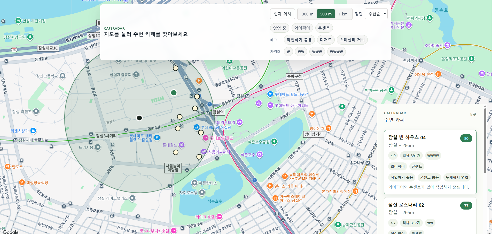

# CafeRadar

CafeRadar는 지도에서 위치를 선택하면 주변 카페를 반경 검색하고, 거리·평점·리뷰 수·작업 친화 요소를 조합해 추천 순위를 보여주는 GIS 기반 카페 탐색 프로젝트입니다.

## 주요 기능

- 지도 클릭 또는 브라우저 현재 위치로 검색 지점 선택
- 300m, 500m, 1000m 반경의 주변 카페 검색
- PostGIS `geography(Point, 4326)` 기반 거리 계산과 반경 필터링
- 카페 마커, 검색 반경, 결과 리스트, 상세 패널 표시
- 영업 중, 와이파이, 콘센트, 가격대, 태그 필터
- 추천순, 거리순, 평점순, 리뷰순 정렬
- 평점·거리·작업 친화도·인기도를 나누어 보여주는 추천 점수
- 서울 주요 10개 권역의 합성 카페 200개 자동 생성

## 아키텍처

```text
Browser
  |
  | React map/search UI
  v
Frontend container (nginx static hosting)
  |
  | /api proxy
  v
Backend container (Spring Boot REST API)
  |
  | JPA repository + native PostGIS query
  v
PostgreSQL/PostGIS container
```

백엔드는 Controller, Service, Repository 계층으로 나누었습니다. 컨트롤러는 HTTP 요청 검증과 응답 계약을 담당하고, 서비스는 검색 조건·필터·정렬·추천 점수 계산을 조합하며, Repository는 PostGIS 반경 검색 쿼리를 담당합니다.

프론트엔드는 지도 상태와 검색 조건을 기준으로 주변 카페 API를 호출합니다. 지도 컴포넌트는 Google Maps JavaScript API가 없을 때도 기본 미리보기 화면으로 동작하도록 구성했습니다.

## PostGIS 활용

카페 테이블은 위도·경도 숫자 컬럼과 함께 `geom geography(Point, 4326)` 생성 컬럼을 가집니다.

```sql
geom geography(Point, 4326) GENERATED ALWAYS AS (
    ST_SetSRID(ST_MakePoint(longitude, latitude), 4326)::geography
) STORED
```

주변 검색은 `ST_DWithin`으로 선택 지점 반경 안의 카페만 가져오고, `ST_Distance`로 미터 단위 거리를 계산합니다. `geography` 타입을 사용해 위경도 좌표에서도 반경 검색 결과를 미터 단위로 다루기 쉽게 했습니다.

```sql
WHERE ST_DWithin(
    c.geom,
    ST_SetSRID(ST_MakePoint(:lng, :lat), 4326)::geography,
    :radiusMeters
)
```

공간 인덱스는 `GIST` 인덱스로 구성했습니다.

## 추천 점수

추천 점수는 MVP에서 설명 가능성을 우선한 규칙 기반 모델입니다.

```text
recommendationScore =
  ratingScore * 0.35
  + distanceScore * 0.30
  + workFriendlyScore * 0.25
  + popularityScore * 0.10
```

- `ratingScore`: 평점을 5점 만점 기준으로 0~100점 환산
- `distanceScore`: 선택 지점에서 가까울수록 높고, 선택 반경 끝에서는 0점
- `workFriendlyScore`: 와이파이, 콘센트, 좌석 수를 반영
- `popularityScore`: 리뷰 수를 500개 기준으로 0~100점 환산

API 응답은 최종 점수뿐 아니라 세부 점수와 추천 사유를 함께 내려주므로, 사용자는 “왜 이 카페가 위에 있는지”를 확인할 수 있습니다.

## API

```text
GET /api/cafes/nearby?lat=37.5446&lng=127.0559&radius=500
GET /api/cafes/{cafeId}
```

`/api/cafes/nearby`는 선택한 위도·경도와 반경을 기준으로 주변 카페를 조회합니다. 검색 결과에는 거리, 평점, 리뷰 수, 편의 시설, 추천 점수와 추천 사유가 포함됩니다.

`/api/cafes/{cafeId}`는 특정 카페의 상세 정보를 조회합니다. 주변 검색 결과에서 카페를 선택했을 때 상세 패널에 표시할 정보를 제공합니다.

## 실행 방법

루트에 `.env` 파일을 만든 뒤 전체 스택을 실행합니다.

```bash
cp .env.example .env
docker compose up -d --build
```

Google Maps를 실제 지도로 표시하려면 `.env` 또는 `frontend/.env.local`에 `VITE_GOOGLE_MAPS_API_KEY`를 설정합니다. 키가 없으면 프론트엔드는 지도 대신 기본 미리보기 화면을 보여주며, API 검색 기능 검토는 계속할 수 있습니다.

컨테이너 종료:

```bash
docker compose down
```

데이터 볼륨까지 초기화하려면:

```bash
docker compose down -v
```

## 샘플 데이터

데이터는 실제 매장 정보가 아니라 포트폴리오 검토용으로 생성한 안전한 샘플입니다.

시드 범위:

- 강남
- 성수
- 홍대
- 연남
- 합정
- 을지로
- 잠실
- 신촌
- 이태원
- 여의도

각 권역마다 20개씩, 총 200개 카페가 생성되도록 설계했습니다. 재시작 시 중복 삽입을 피하도록 이름 기준 충돌 처리를 둡니다.

## 대표 화면

지도에서 위치를 선택하면 검색 반경, 카페 마커, 결과 리스트, 상세 정보가 한 화면에 표시됩니다.



## 구현 포인트

- 단순 목록 조회가 아니라 선택 좌표 기준의 공간 반경 검색을 구현했습니다.
- 추천 점수를 API에서 계산해 프론트엔드와 백엔드의 책임을 분리했습니다.
- 점수 근거를 응답에 포함해 추천 결과를 설명 가능하게 만들었습니다.
- 실제 서비스 데이터나 스크래핑 없이도 검토 가능한 합성 데이터를 자동으로 준비했습니다.
- `docker compose up -d --build` 한 번으로 PostGIS, Spring Boot API, React 정적 앱을 실행하도록 구성했습니다.

## AI 및 도구 사용

이 프로젝트는 Codex를 사용해 태스크 기반 구현, 문서 정리, 검증 기록을 보조했습니다. 설계 기준과 수용 조건은 `docs/SPEC.md`와 `docs/tasks/`에 명시했고, 생성된 코드는 사람이 검토 가능한 작은 단위의 태스크로 나누어 관리했습니다.

## 기술 스택

| 영역 | 기술 |
| --- | --- |
| Frontend | React, Google Maps JavaScript API |
| Backend | Java 17, Spring Boot 3, Spring Data JPA |
| Database | PostgreSQL 16, PostGIS |
| Runtime | Docker Compose |
| Data | Flyway migration, 샘플 데이터 시드 |
